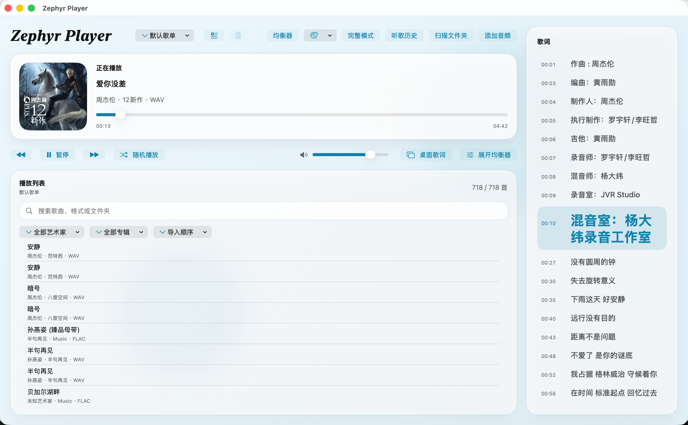
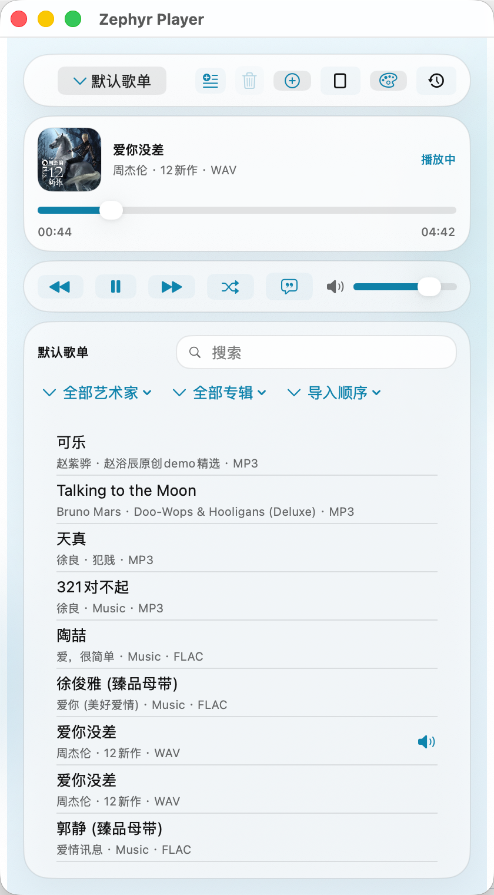
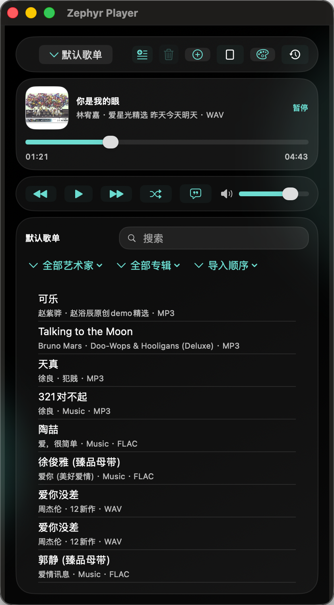
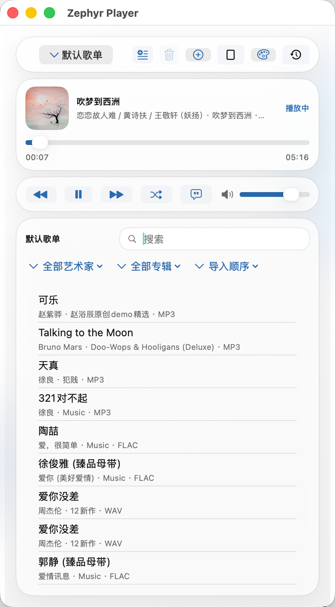
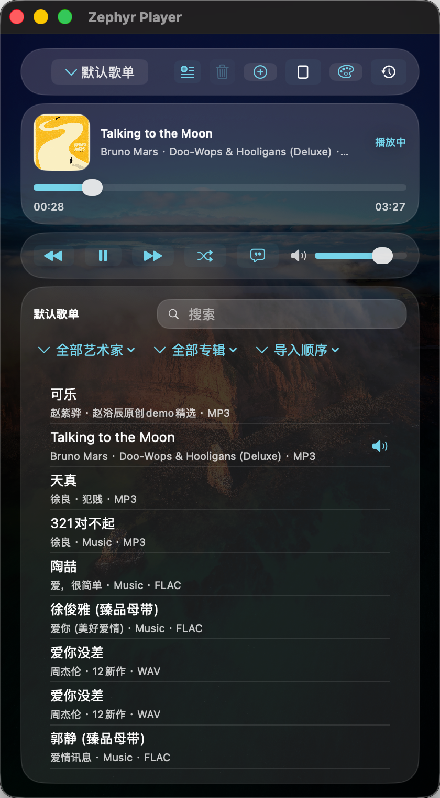

# Zephyr Player

Zephyr Player 是一个面向 macOS 的原生本地音乐播放器，基于 `SwiftUI` 和 `AVFoundation` 构建，聚焦本地音频播放、歌词体验、歌单管理和桌面使用场景。

## Preview

完整模式



简洁模式






## Features

- 支持格式：`FLAC`、`WAV`、`MP3`、`DSF`、`DFF`、`DSD`
- 支持拖拽导入、批量导入、文件夹递归扫描
- 支持多歌单、歌单搜索、筛选、排序、删除、下一首播放
- 支持内嵌歌词、同名 `.lrc` / `.txt`、在线歌词补全
- 支持逐行歌词高亮、点击歌词跳转播放时间
- 支持专辑封面读取与在线补全
- 支持桌面歌词、菜单栏迷你控制器、完整模式 / 简洁模式
- 支持顺序播放、循环播放、随机播放
- 支持 10 段均衡器与常用预设
- 支持应用状态恢复与听歌历史统计

## Requirements

- macOS 13.0 及以上
- Xcode 16 及以上
- Swift 5

## Quick Start

### 使用 Xcode

```bash
git clone https://github.com/Zephyrbather/Zephyr-Music.git
cd music
open MusicPlayer.xcodeproj
```

在 Xcode 中：

1. 选择 `MusicPlayer` Scheme
2. 点击 `Run`

构建完成后，应用会自动复制到：

```bash
~/Downloads/Zephyr Player.app
```

### 使用命令行编译

```bash
xcodebuild -project MusicPlayer.xcodeproj -scheme MusicPlayer -configuration Debug build
```

命令行构建完成后，同样会自动复制到：

```bash
~/Downloads/Zephyr Player.app
```

## Usage

### 导入音乐

- 添加单个或多个音频文件
- 扫描整个文件夹并递归导入
- 直接将文件或文件夹拖入窗口
- 从其他歌单复制歌曲到当前歌单

### 歌词系统

- 优先级：内嵌歌词 > 同名 `.lrc` / `.txt` > 在线补全
- 支持时间轴歌词逐行高亮
- 支持点击歌词跳转时间片
- 支持桌面歌词浮窗、多种显示模式与交互

### 歌单与检索

- 支持多歌单切换与自定义命名
- 支持歌单内搜索
- 支持按艺术家 / 专辑筛选
- 支持排序与关键字高亮
- 支持待播队列与“下一首播放”

### 个性化与统计

- 支持系统主题、纯黑、纯白、马卡龙色、自定义图片主题
- 支持桌面歌词字号、透明度、背景样式、锁定位置
- 支持月度统计、年度统计、最近 100 首记录

## Project Structure

```text
.
├── LICENSE
├── MusicPlayer.xcodeproj
├── Package.swift
├── README.md
├── Sources/MusicPlayer
│   ├── AudioAssetLoader.swift
│   ├── AudioTrack.swift
│   ├── ContentView.swift
│   ├── DesktopLyricsWindowController.swift
│   ├── LyricsParser.swift
│   ├── MusicPlayerApp.swift
│   ├── OnlineMetadataService.swift
│   ├── PlayerTheme.swift
│   └── PlayerViewModel.swift
└── XcodeApp
    ├── Assets.xcassets
    └── Info.plist
```

## Notes

- 项目依赖 macOS 原生音频解码能力，部分 `DSD` 文件的可播放性取决于系统支持情况
- 在线歌词和封面补全依赖网络请求，无网络时不影响本地播放
- 听歌历史、应用状态、在线歌词缓存、在线封面缓存均保存在本地

## License

本项目采用 [MIT License](./LICENSE)。
