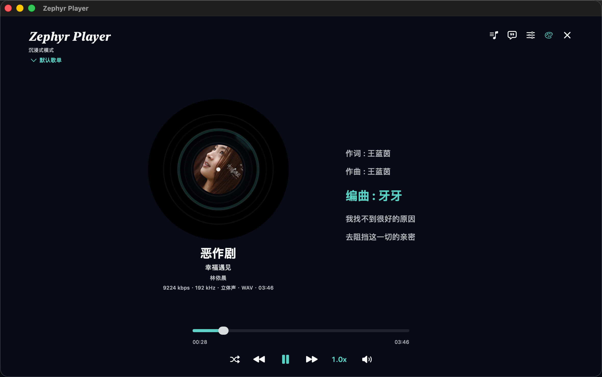

# Zephyr Player

Zephyr Player 是一个面向 macOS 的原生本地音乐播放器，基于 `SwiftUI` 和 `AVFoundation` 构建，聚焦本地音频播放、歌词体验、歌单管理和桌面使用场景。当前仓库包含源码、可直接分发的压缩包，以及与压缩包对应的校验文件。

## 下载

- 最新发布包：[Zephyr-Player-v1.1.0-macOS.zip](./dist/Zephyr-Player-v1.1.0-macOS.zip)
- 校验文件：[Zephyr-Player-v1.1.0-macOS.zip.sha256](./dist/Zephyr-Player-v1.1.0-macOS.zip.sha256)
- 当前应用版本：`1.1.0`
- 最低系统要求：`macOS 13.0`

说明：
仓库内的 release 包为未签名构建，首次打开时如果被系统拦截，可在 Finder 中右键应用后选择“打开”。

## 版本亮点

- 完整模式和简洁模式的歌单会默认定位到当前播放歌曲，并新增“定位到正在播放”按钮。
- 新增播放快捷键设置，默认使用 Mac 键盘媒体键 `F7 / F8 / F9`，也可以自定义。
- 优化大歌单滚动性能，降低播放进度刷新时的列表重绘。
- 顶部菜单和设置入口补齐中文化，设置页可直接切换语言和修改快捷键。

## 界面预览

完整模式


沉浸模式



简洁模式

<p align="left">
  
  
  
  
</p>

## 功能概览

### 本地播放与导入

- 支持格式：`FLAC`、`WAV`、`MP3`、`DSF`、`DFF`、`DSD`
- 支持拖拽导入、批量导入、文件夹递归扫描
- 支持顺序播放、列表循环、随机播放
- 支持自定义播放快捷键和媒体键控制

### 歌单与检索

- 支持多歌单切换、自定义命名、删除、排序
- 支持歌单搜索、艺术家/专辑筛选、关键字高亮
- 支持待播队列和“下一首播放”
- 支持快速定位当前播放歌曲

### 歌词与封面

- 优先使用内嵌歌词，其次查找同名 `.lrc` / `.txt`
- 支持逐行歌词高亮、点击歌词跳转播放时间
- 支持在线歌词与封面补全
- 支持桌面歌词、沉浸式歌词体验、桌面歌词设置面板

### 个性化与数据

- 支持完整模式、简洁模式、沉浸式模式
- 支持系统主题、纯黑、纯白、马卡龙色和自定义图片背景
- 支持 10 段均衡器、预设与自定义保存
- 支持应用状态恢复、个人数据导入导出、听歌历史统计

## 环境要求

- macOS 13.0 及以上
- Xcode 16 及以上
- Swift 5

## 本地运行

### 使用 Xcode

```bash
git clone https://github.com/Zephyrbather/Zephyr-Music.git
cd Zephyr-Music
open MusicPlayer.xcodeproj
```

在 Xcode 中：

1. 选择 `MusicPlayer` Scheme
2. 点击 `Run`

构建完成后，应用会自动复制到：

```bash
~/Downloads/Zephyr Player.app
```

### 使用命令行编译

```bash
xcodebuild -project MusicPlayer.xcodeproj -scheme MusicPlayer -configuration Debug build
```

命令行构建完成后，同样会自动复制到：

```bash
~/Downloads/Zephyr Player.app
```

### 生成 Release 包

```bash
xcodebuild -project MusicPlayer.xcodeproj -scheme MusicPlayer -configuration Release clean build
ditto -c -k --sequesterRsrc --keepParent ~/Downloads/"Zephyr Player.app" ./dist/Zephyr-Player-v1.1.0-macOS.zip
shasum -a 256 ./dist/Zephyr-Player-v1.1.0-macOS.zip > ./dist/Zephyr-Player-v1.1.0-macOS.zip.sha256
```

## 使用说明

### 导入音乐

- 添加单个或多个音频文件
- 扫描整个文件夹并递归导入
- 直接将文件或文件夹拖入窗口
- 在多个歌单之间整理和复制歌曲

### 快捷键

- 默认播放控制使用媒体键 `F7 / F8 / F9`
- 可在“设置”中重录上一首、播放/暂停、下一首快捷键
- 自定义普通键盘快捷键时，至少需要一个修饰键
- `F1-F20` 可以单独录制

### 歌词与元数据

- 优先级：内嵌歌词 > 同名 `.lrc` / `.txt` > 在线补全
- 支持时间轴歌词逐行高亮
- 支持点击歌词跳转时间点
- 支持在线搜索歌词和封面来源

### 个性化与统计

- 支持主题切换、背景自定义、桌面歌词样式调整
- 支持月度统计、年度统计、最近播放记录
- 支持个人数据导入导出

## 项目结构

```text
.
├── LICENSE
├── MusicPlayer.xcodeproj
├── Package.swift
├── README.md
├── dist
│   ├── Zephyr-Player-v1.1.0-macOS.zip
│   └── Zephyr-Player-v1.1.0-macOS.zip.sha256
├── Sources/MusicPlayer
│   ├── AudioAssetLoader.swift
│   ├── AudioTrack.swift
│   ├── ContentView.swift
│   ├── DesktopLyricsWindowController.swift
│   ├── LyricsParser.swift
│   ├── MusicPlayerApp.swift
│   ├── OnlineMetadataService.swift
│   ├── PlaybackShortcuts.swift
│   ├── PlayerTheme.swift
│   └── PlayerViewModel.swift
└── XcodeApp
    ├── Assets.xcassets
    └── Info.plist
```

## 说明

- 项目依赖 macOS 原生音频解码能力，部分 `DSD` 文件的可播放性取决于系统支持情况
- 在线歌词和封面补全依赖网络请求，无网络时不影响本地播放
- 听歌历史、应用状态、在线歌词缓存、在线封面缓存均保存在本地
- 当前仓库为 AI 辅助生成项目，适合本地试听与桌面场景使用

## License

本项目采用 [MIT License](./LICENSE)。
